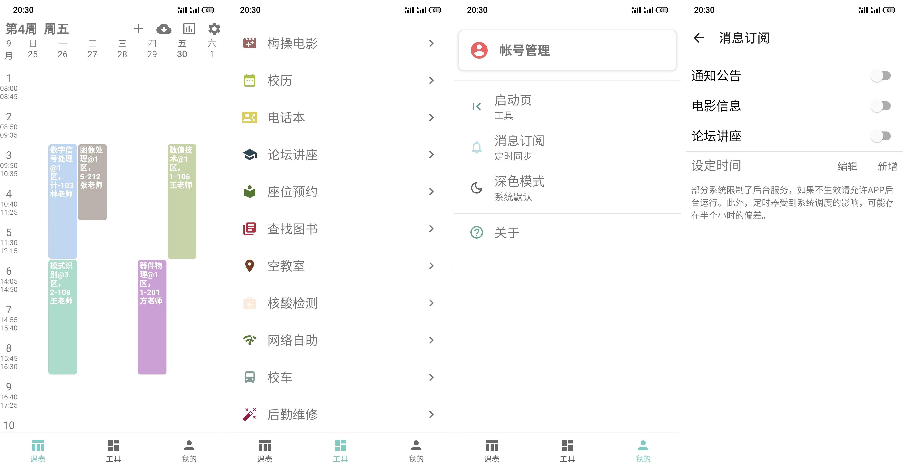

### 吾学

汇集学校内主要的数据信息渠道，包括通知公告、梅操电影、校历、图书馆座位预约、馆藏图书、课表管理、成绩统计。
**已公开所有代码**

#### 预览图

#### 已知问题

* 重启后消息订阅可能失效
* 图书馆座位预约界面存在性能问题

#### 实现

* 所有数据来自官方页面进行二次整理
* 登录的实现：
  * 需要登录的页面通过“统一身份认证”完成
  * 为了保持登录信息，登录后保存统一认证的Cookies，未保存帐号和密码
  * 可以理解为通过信息门户进行跳转
